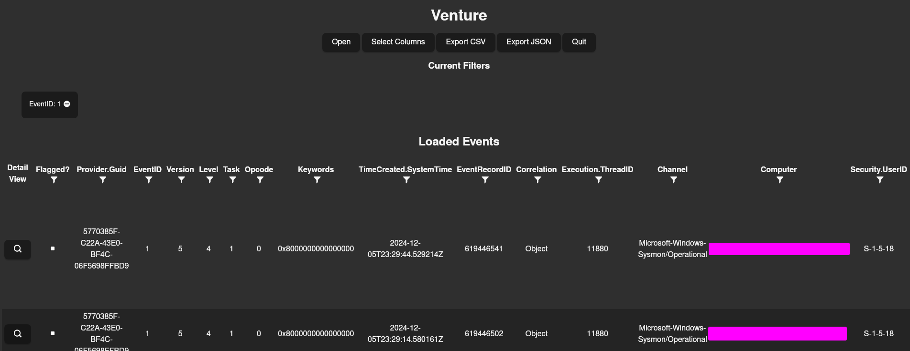

# Venture: Windows Event Viewing Made Easy

Venture is a cross-platform viewer for Windows Event Logs (`.evtx` files). Built with the [Tauri](https://tauri.app), it is intended as a fast, standalone tool for quickly parsing and slicing Windows Event Log files during incident response, digital forensics, and CTF competitions.

## Why Does This Exist?

While projects like `evtxtools` do a great job on the command line, sometimes a graphical interface is valuable for easy viewing and investigation. A few other features are helpful as well.

## Features

- Load any EVTX file and parse columns
- CSV/JSON export
- Filter on all columns (string/number values)
- Flag items of interest; filter on flagged items only
- Tabular event view
- JSON detail event view
- Paginated data

## Roadmap

- [ ] Date-based filters
- [ ] Rearrangeable Columns
- [ ] Custom tags for Events

## Usage

1. Install the application
2. Open a `.evtx` file
3. Use filters, click on columns for sorting, and flag interesting items.

## Acknowledgements

This project is created with the support of [UCLA Health](https://uclahealth.org). Many thanks for the freedom to build this program for all!